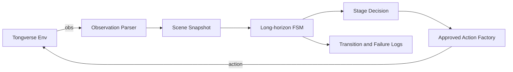
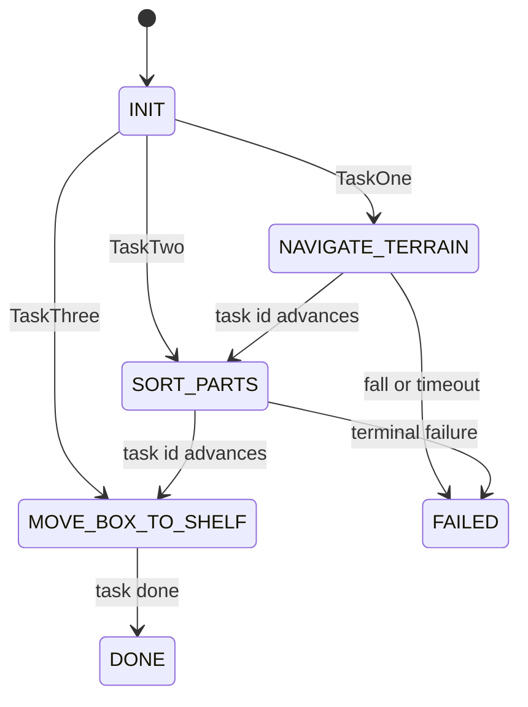

# 架构

## 原则

- `TaskSolver` 是唯一对外算法入口。
- observation 先被解析为稳定的内部快照，再交给规划器。
- 规划器只决定阶段和动作意图，不直接拼装底层 action。
- 控制层集中构造和校验官方 action，防止绕过接口。
- 每个阶段逐步替换中性策略，未验证策略不得静默进入 `main`。

## 代码边界

| 模块 | 职责 | 禁止事项 |
|---|---|---|
| `task_solver.py` | 编排入口 | 堆叠阶段细节 |
| `perception/` | 解析 RGB-D、IMU、本体和任务信息 | 调用环境控制函数 |
| `planner/` | FSM、超时、重试、恢复与阶段策略 | 直接生成非法 action |
| `control/` | 动作原语与 action 合规校验 | 绕过官方 action |
| `models.py` | 内部数据模型 | 依赖 Tongverse |

## 首版状态机

当前实现每次 `tick` 最多发生一次状态转换，避免同一仿真步内连跳。控制策略目前仅为中性动作，后续按 Issue 分别接入地形、抓取和搬箱动作原语。

